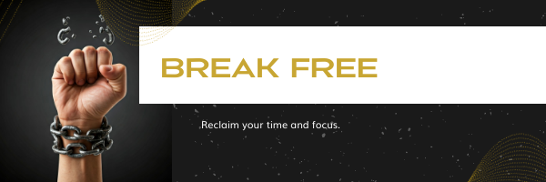

# Melius 🎯



## Introduction 👋

Melius is born out of a desire to provide individuals struggling with porn addiction a safe, anonymous, and effective platform for recovery. The core mission of Melius is to offer a combination of community support, resource access, and personal tracking—all while ensuring complete privacy.

- **Deployed site**: [Melius website](http://meliusrecovery.me/)
- **Final project blog article**: [Read here](#)
- **Authors**:
  - Eyad Abdelfattah – Backend Developer  
    [GitHub](https://github.com/eyadfattah23) | [LinkedIn](https://www.linkedin.com/in/eyad-fattah/)
  - Lamia Hamdi – Frontend Developer  
    [GitHub](https://github.com/Lamia1406) | [LinkedIn](https://www.linkedin.com/in/lamia-hamdi/)
  - Larini Abdllah – Backend Developer  
    [GitHub](https://github.com/laribox) | [LinkedIn](https://www.linkedin.com/in/larini-abdllah/)

## Table of Contents 📑

- [Melius 🎯](#melius-)
  - [Introduction 👋](#introduction-)
  - [Table of Contents 📑](#table-of-contents-)
  - [Motivation \& Inspiration 💡](#motivation--inspiration-)
  - [Technical Overview 🛠️](#technical-overview-️)
    - [Frontend](#frontend)
    - [Backend](#backend)
    - [Key Algorithms and Solutions 🧠](#key-algorithms-and-solutions-)
  - [Features 🛠️](#features-️)
  - [Challenges and Solutions 🤔](#challenges-and-solutions-)
  - [Future Enhancements 🚀](#future-enhancements-)
  - [Screenshots and Visuals 🖼️](#screenshots-and-visuals-️)
  - [Installation :cd:](#installation-cd)
    - [Install with Bash Script](#install-with-bash-script)
  - [Manual Installation](#manual-installation)
    - [Prerequisites](#prerequisites)
    - [Clone the Repository](#clone-the-repository)
    - [Install Dependencies](#install-dependencies)
    - [Install frontend dependencies:](#install-frontend-dependencies)
    - [Set Up MySQL](#set-up-mysql)
    - [Set Up Nginx](#set-up-nginx)
    - [Run the Application](#run-the-application)
  - [Usage 📖](#usage-)
  - [Contributing 🤝](#contributing-)
  - [Related Projects 🌐](#related-projects-)
  - [License ⚖️](#license-️)

---

## Motivation & Inspiration 💡

The idea behind Melius started from a personal experience with a close friend struggling with porn addiction. Watching this friend battle the addiction and trying different solutions without success motivated the team to create something that addresses the root of the problem in a more effective and compassionate way. We believe that privacy, community support, and easily accessible tools are crucial to overcoming this challenge. With this passion, the Melius team is dedicated to helping others take control of their lives.

Melius has grown into more than just a technical project. It’s a tool built with empathy, a product of deep thought and a desire to make a real difference in people’s lives.

## Technical Overview 🛠️

Here’s a breakdown of the technology stack and architectural decisions:

### Frontend

- **React:** The frontend is powered by React for efficient UI rendering and easy state management.
- **Tailwind:** The CSS framework used for styling and layout.
- **shadcn/ui:** A collection of UI components and utilities for building web applications.

### Backend

- **Flask (Python):** Chosen for its lightweight nature, Flask allowed us to build out APIs quickly while maintaining flexibility.
- **JWT (JSON Web Tokens):** Authentication is handled with JWT to ensure that user sessions are stateless and secure.
- **MySQL:** Used for efficient storage of user progress and logs, chosen for its scalability and robustness.

### Key Algorithms and Solutions 🧠

One of the core challenges I encountered was [describe a key technical challenge]. After a few iterations, I chose to implement [solution or algorithm]. Here’s a breakdown of how it works:

```kotlin
// Example of the core algorithm or solution in Kotlin
fun calculateOrderTotal(order: List<OrderEntry>): Double {
    return order.sumOf { it.quantity * it.price }
}
```

## Features 🛠️

- **Anonymous Account Creation**: Users can sign up without sharing personal information.
- **Progress Tracking**: Monitor your progress over time and gain achievements the longer you stay on track.
- **Resource Hub**: Access articles, videos, and exercises to support recovery.
- **Community Support**: Engage with a like-minded community to share experiences and encourage one another.
- **Privacy Protection**: Data security is a top priority, ensuring anonymity at all stages.

## Challenges and Solutions 🤔

While building **Melius**, We faced several obstacles that required creative solutions:

- **Challenge 1: Securing the API (JWT Implementation)**  
  One of the key challenges was ensuring the security of user data. To address this, We implemented **JWT (JSON Web Tokens)** for authentication, ensuring that user sessions were stateless and secure. This allowed us to protect the API while maintaining a seamless user experience.

- **Challenge 2: CORS Errors on Deployment**  
  After deploying the app, we kept encountering **CORS errors**, even though CORS was integrated properly in Flask. The issue stemmed from the frontend pointing to `localhost` instead of the server IP. The solution was to update the frontend API endpoint to point to the server’s IP address and adjust the placement of the CORS handling middleware within the Flask app code.

- **Challenge 3: API Documentation Confusion (OpenAPI Version)**  
  We initially used **Flasgger** for API documentation, but it was set up with OpenAPI v3 syntax, which Flasgger does not fully support—it only supports OpenAPI v2. This led to confusion and incorrect API documentation. The solution was to refactor the documentation using **OpenAPI v2 syntax**, ensuring it worked properly with Flasgger.

- **Challenge 4: Optimizing Frontend Requests**  
  Our frontend started slowing down due to large requests for posts, likes, and comments. We solved this by:

  - Implementing **pagination** for large data sets.
  - Optimizing the requests by fetching related data (e.g., posts, likes, comments) in a single request, reducing the need for multiple API calls.
  - These improvements reduced load times and optimized performance.

- **Challenge 5: Deployment Issues (Node and npm Versions)**  
  During deployment, we kept encountering outdated versions of **Node.js** and **npm**, despite running `apt update`. The fix involved manually installing the latest versions by adding the Node.js PPA repository, which resolved the version mismatch issues.

- **Challenge 6: Non-Technical Challenges (Communication & Deadlines)**  
  We also faced non-technical issues, such as communication gaps, availability conflicts, and difficulty conveying ideas effectively. Additionally, managing responsibilities outside of the project made it challenging to meet deadlines. However, clear communication and coordination allowed us to overcome these hurdles and deliver the project on time.

Each of these challenges helped us grow in problem-solving, performance optimization, communication, and team coordination.

## Future Enhancements 🚀

Here's what I plan for the next iteration of **Melius**:

- **Donation Feature**: Allow users to support the platform through donations.
- **Voice Chat**: Enable voice communication between users for additional support.
- **Goal Setting**: Add a feature to set monthly or weekly goals. Completing these goals will reward users with points or achievements.

- **Graphs of users progress.**

- **Tests**: Add a feature to make users take small quizzes to measure their addiction levels.

- **AI**: Add an AI engine to manage posts.

There's always room to refine and evolve this project, and I'm excited about future possibilities.

---

## Screenshots and Visuals 🖼️

Here are some screenshots of the app in action:
| Image | Description |
|-------|-------------|
| [](./images/Screenshots_1.jpg) | This is the description for image 1. Click the image to enlarge. |
| [](./images/Screenshots_2.jpg) | This is the description for image 2. Click the image to enlarge. |
| [](./images/Screenshots_3.jpg) | This is the description for image 3. Click the image to enlarge. |

## Installation :cd:

You can either use the provided Bash script or manually install the application as detailed below.

### Install with Bash Script

Run the automated installation with the following commands:

```bash
cd /var
chmod u+x melius.sh
./melius.sh
```

## Manual Installation

### Prerequisites

- Python 3.x
- Pip
- MySQL
- Nginx
- Node.js
- npm

### Clone the Repository

```bash
git clone https://github.com/eyadfattah23/Melius.git
cd Melius
```

### Install Dependencies

```bash
pip install -r requirements.txt
```

### Install frontend dependencies:

```bash
cd frontend
npm install
```

### Set Up MySQL

```bash
cd /var/Melius
mysql -u root < setup_mysql_dev.sql
```

### Set Up Nginx

Update Nginx configuration with the appropriate settings

### Run the Application

```bash
cd /var/Melius
python3 -m api.v1.app
```

```bash
cd frontend
npm run dev
```

## Usage 📖

Once the application is running, access it via your browser:

- Backend: <http://localhost:5050>
- Frontend: <http://localhost:3000>
- API Documentation : <http://localhost:5050/apidocs/>
- API Endpoint : <http://localhost:5050/api/v1>

Users can create anonymous accounts, track their progress, and access resources.

## Contributing 🤝

Contributions are welcome! To contribute:

1.  Fork the repository.
2.  Create a new branch (`git checkout -b feature-branch`).
3.  Commit your changes (`git commit -m 'Add some feature'`).
4.  Push to the branch (`git push origin feature-branch`).
5.  Open a pull request.

Ensure your code follows PEP8 guidelines, is documented, and includes unit tests for any new features.

## Related Projects 🌐

- **[NoFap](https://nofap.com/)**: A community-driven platform supporting recovery.
- **[Reboot Nation](https://rebootnation.org/)**: Another initiative aimed at overcoming porn addiction.

## License ⚖️

This project is licensed under the MIT License. See the LICENSE file for more details.
